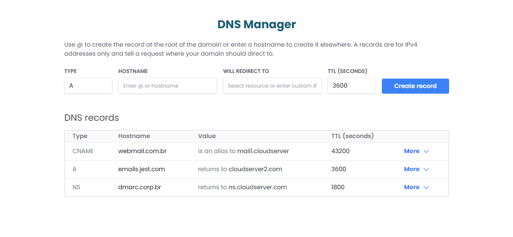

<h1 align="center"> DNS Manager </h1>
<br>
<p align="center">
  
</p>
<p align="center">
  <em>Confira o resultado do app em: https:// /</em>
</p>

# 💻 Projeto

O DNS Manager é uma aplicação para gerenciar registros DNS de forma intuitiva. A aplicação oferece as seguintes funcionalidades:

- Listagem de Registros DNS: Exibe uma tabela com registros DNS, incluindo tipo, hostname, valor e TTL.
- Adicionar Registros: Permite adicionar novos registros DNS através de um formulário.
- Editar Registros: Facilita a edição de registros DNS existentes com campos editáveis e confirmação de alterações.
- Excluir Registros: Permite remover registros DNS indesejados.
- Validação de Formulário: Valida entradas do usuário para garantir que todos os campos sejam preenchidos corretamente antes de adicionar ou editar registros.

Para o desenvolvimento dessas funcionalidades, foram utilizados conceitos como:

- Estados e gerenciamento de estado no React
- Validação de formulários com react-hook-form e zod
- Componentização e propriedades no React
- Estilização com Tailwind CSS

# 🚀 Tecnologias

Esse projeto foi desenvolvido com as seguintes tecnologias:

- HTML
- TypeScript
- React + NextJs
- Tailwind CSS
- react-hook-form e zod para validação de formulários
- Git e GitHub

## 🛠️ Execução do projeto

- Passo 1: Clone este repositório.

```bash
git clone https://github.com/hevelinlima/dns-manager.git
```

- Passo 2: Navegue até o Diretório do Projeto:

```bash
cd dns-manager
```

- Passo 3: Instale as Dependências:

  - Certifique-se de ter o Node.js e npm (ou yarn) instalados em sua máquina.
  - Instale as dependências do projeto executando:

  ```bash
  npm install
  ```

  ou

  ```bash
  yarn install
  ```

- Passo 4: Execute o Projeto:

Para iniciar o servidor de desenvolvimento, execute:

```bash
npm run dev
```

ou

```bash
yarn dev
```

Agora que você clonou com sucesso o repositório e configurou as dependências do projeto localmente, você pode fazer alterações, desenvolver novos recursos e contribuir de volta para o repositório original quando estiver pronto.

---

Feito com ♥ by hevelinlima
